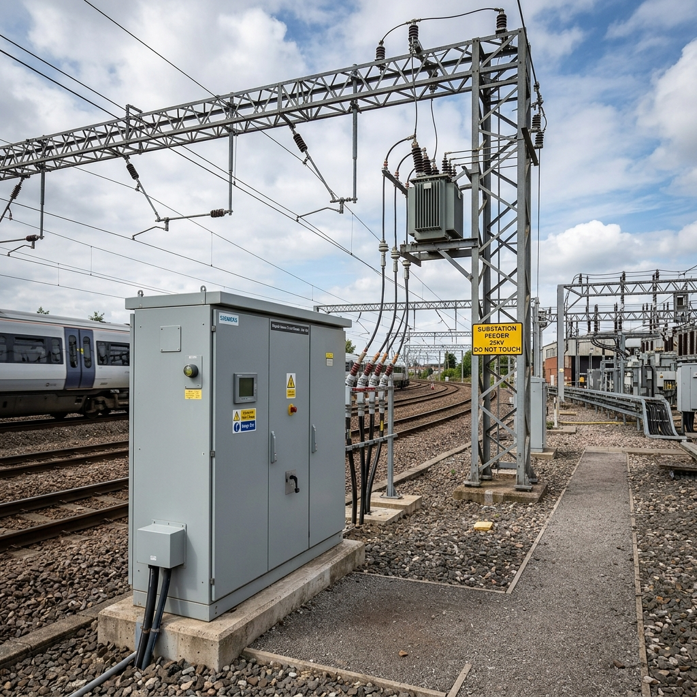

# Electrification of Railway Network - Executive Market Intelligence Dashboard

A high-fidelity interactive executive infographic dashboard recreating the corporate market-intelligence presentation for **"Electrification of Railway Network (% of total route)"**.



## 🚆 Project Highlights

- **Executive 16:9 Presentation Canvas**: Optimized for standard desktop displays (1600×900 / 1920×1080) with intelligent responsive layout for tablets and mobile devices.
- **Interactive SVG World Map**: Detailed global vector map color-coded by electrification percentage with hover tooltips and click-to-open intelligence modals for each nation.
- **Untapped Markets & Top Countries**: Semi-circular gauge indicators and benchmark vertical bar charts.
- **2x2 Executive Grid**:
  - **Products**: Trackside & on-board VCB switchgear, Ring Main Units (RMU), and vacuum interrupters.
  - **Directors**: High-resolution executive leadership portraits with detailed biographies, achievements, and credentials.
  - **Secured Vans Market**: Multi-year turnover growth forecasts (2027–2029) for Way Side and On Board VCBs with CAGR metrics.
  - **Upcoming Products**: Next-gen R&D offerings including SF6-free eco-gas RMUs and 72.5kV vacuum interrupters.

## 🛠️ Tech Stack

- **Framework**: React 19 + Vite 8
- **Styling**: Vanilla CSS3 + Modern Corporate Typography (`Outfit` & `Inter`)
- **Icons**: Lucide React
- **Graphics & Maps**: Custom Vector SVG

## 🚀 Getting Started

### 1. Install Dependencies
```bash
npm install
```

### 2. Start Development Server
```bash
npm run dev
```
Open [http://localhost:3000](http://localhost:3000) in your browser.

### 3. Build for Production
```bash
npm run build
```

---
*Built for Executive Market Intelligence & Rail Modernization Planning.*
